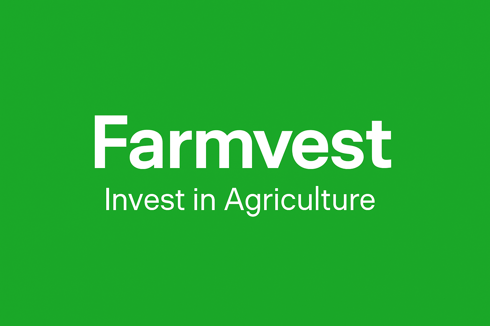
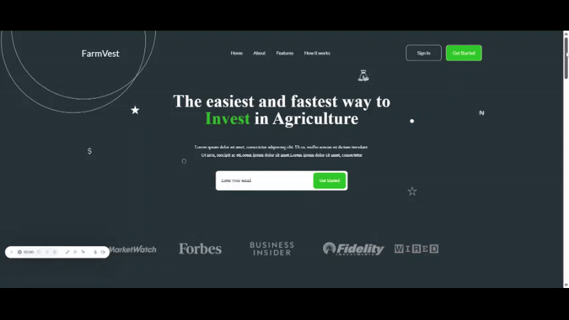
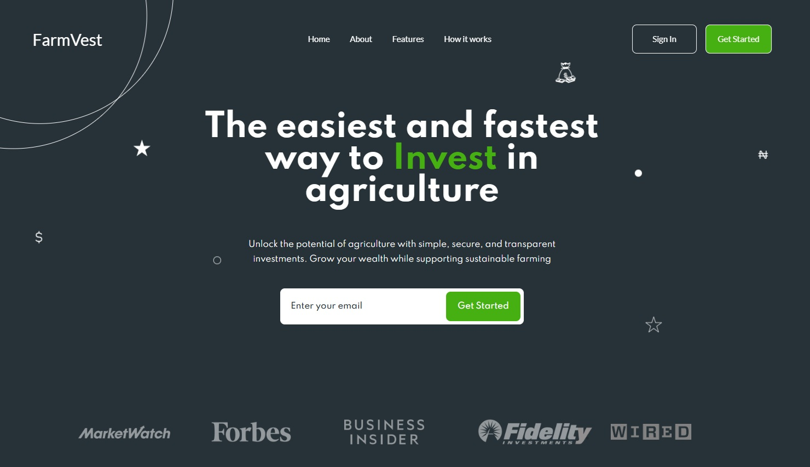
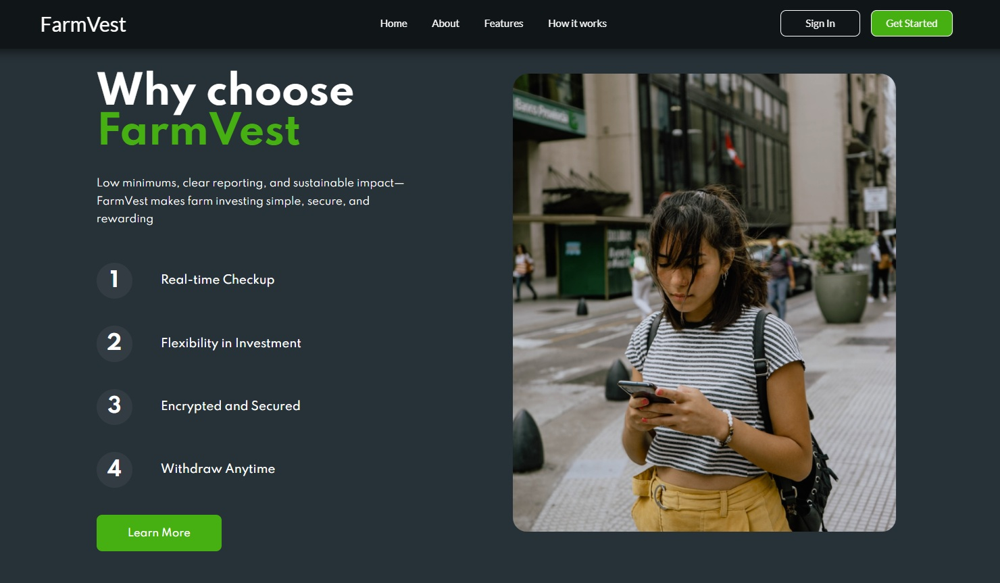
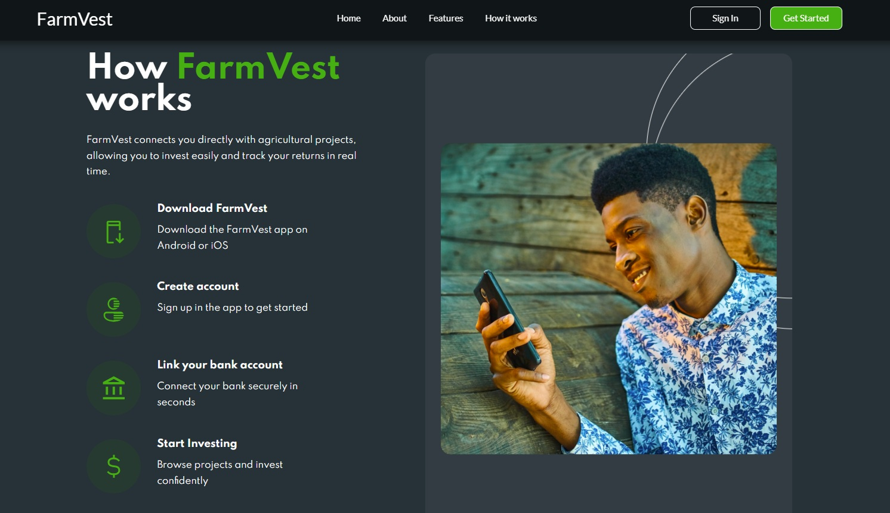
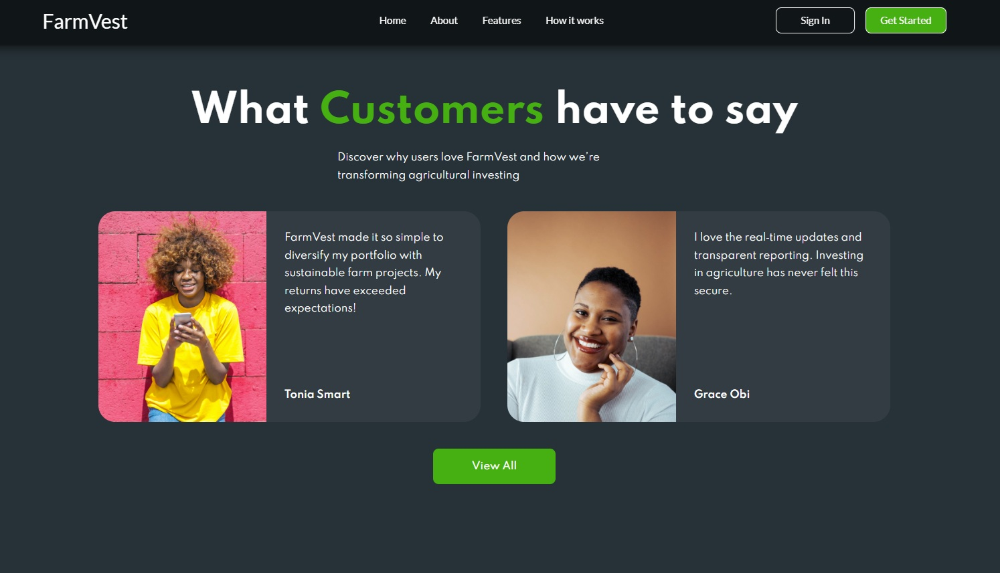
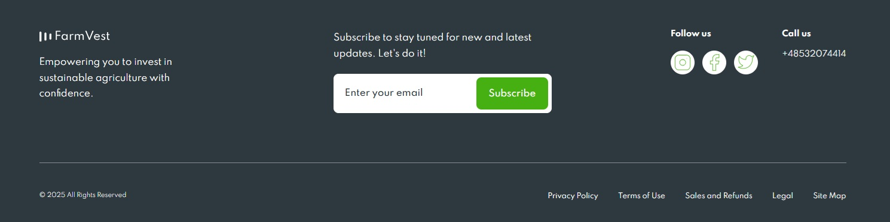

<p align="center">
  
</p>

# 🌱 Farmvest — Invest in Agriculture with Confidence

[🌐 Live Demo](https://yuriidano.github.io/farmvest/)

**Farmvest** is a modern, responsive landing page designed to showcase agriculture investment opportunities with an engaging and user-friendly interface.

## 👨‍💻 About This Project
This project was fully implemented by me as a responsive landing page for an agricultural investment platform.

The design was based on an existing layout, but I implemented the layout from scratch, including responsive behavior, animations, and section structuring.

The focus was on flawless implementation, clean and semantic HTML markup, BEM-based CSS, and a user-friendly interface on all screen sizes.

This project demonstrates my ability to translate user interface design into responsive web pages.

---

## 📽️ Live Preview



---

## 📸 Screenshots

### 🧑‍🌾 Hero Section  


### 📈 Why Choose Us  


### 💼 How It Works  


### 🧾 Testimonials  


### 📲 Get Started  


---

## 🚀 Features

- 🌐 Modern responsive design that adapts to all devices  
- 🔄 Smooth navigation with pleasant animations  
- ⚡ Optimized for fast loading and minimal delays  
- ⚙️ Built with semantic HTML, SCSS, and JavaScript
- 🖱️ Interactive parallax effect in the hero section on mouse move
- 📷 Scroll-based parallax animations for images and content sections

---

## 🛠️ Tech Stack

- **HTML5** — semantic structure  
- **SCSS** — styling with nested syntax and variables  
- **Flexbox** — for flexible, responsive layouts  
- **BEM Methodology** — for clean and maintainable CSS class naming  
- **JavaScript** — for interactivity and DOM manipulation  

---

## 🌐 SEO & Indexing

- Custom `sitemap.xml` and `robots.txt`  
- Site registered and verified in [Google Search Console](https://search.google.com/search-console)  
- Meta tags for SEO (`title`, `description`, `viewport`)  
- OG tags for social media (`og:title`, `og:image`, `og:description`)  

---

## 📁 Project Structure

project/
├── css/         # Contains all project styles (style.css, style.min.css)
├── js/          # JavaScript logic (animations, DOM interactions, etc.)
├── img/         # Images, icons, and background graphics used in the page
├── public/      # Visual assets for README (cover, screenshots, GIF)
├── og-image.jpg # Open Graph image for meta tags (used in previews)
├── google12433bff2453c575.html  # Google verification file
├── index.html   # Main HTML file — the landing page entry point

---

## 🧪 Running Locally

```bash
git clone https://github.com/yuriidano/farmvest.git
cd farmvest
npm install
npm run dev
```


## 🔗 Links

- 🌍 [Live Demo](https://yuriidano.github.io/farmvest/)
- 📦 [GitHub Repository](https://github.com/yuriidano/farmvest)

---

## 👤 Author

**Yurii Dano**  
Frontend Developer  
[GitHub Profile](https://github.com/yuriidano)

